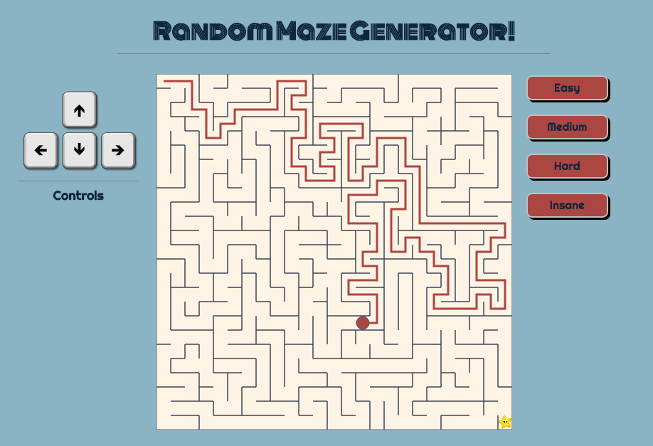

# Random Maze Generator

[Random Maze Generator](https://djfletcher.github.io/MazeGenerator/) is an interactive algorithm visualizer. It utilizes a recursive backtracking algorithm to generate random, solvable mazes that draw themselves as they are built. Once the maze build is complete, it becomes interactive and playable in the browser.



## Features

#### Maze Generating Algorithm

The recursive backtracking algorithm starts with a two dimensional grid of empty cells. The algorithm is provided a starting cell in the grid, and kicks off by breaking through a random wall (north, south, east, or west) into a neighboring cell that has not yet been visited, and repeats the process. Each cell stores a reference to the wall that was broken through to get to it. The maze is complete when all cells have been visited.

````javascript
// The recursive backtracking algorithm
carvePassagesFrom(cx, cy, grid) {
  // Set up constants to aid with describing the passage directions
  const [n, s, e, w] = ['n', 's', 'e', 'w'];
  const dx = { e: 1, w: -1, n: 0, s: 0 };
  const dy = { e: 0, w: 0, n: -1, s: 1 };
  const opposite = { e: w, w: e, n: s, s: n };

  // Randomize the directions to explore from this cell
  const directions = this.shuffle(['n', 's', 'e', 'w']);
  let nx, ny;

  // Validates that next cell is on the grid and has not yet been explored
  const valid = (col, row) => (
    0 <= row && row < grid.length &&
      0 <= col && col < grid[row].length &&
      grid[row][col] === 0
  );

  directions.forEach(direction => {
    nx = cx + dx[direction];
    ny = cy + dy[direction];

    // Saves a reference to the passage carved from this cell
    if (valid(nx, ny)) {
      grid[cy][cx] = grid[cy][cx] || direction;
      grid[ny][nx] = grid[ny][nx] || opposite[direction];

      this.orderBuilt.push({ row: ny, col: nx });
      this.carvePassagesFrom(nx, ny, grid);
    }
  });
}
````

#### Algorithm Visualizer

As the maze algorithm runs, it stores a reference to the order in which each cell was visited. It then draws the maze in the order that each cell was visited so that users can visualize how the recursive backtracking algorithm works.


#### Interactive Game

Once the maze is completely built, users are able to use the keyboard to travel through the maze and try to solve it. For collision detection, the Player class is provided an abstraction of the maze that was just built. The abstraction is in the form of a two dimensional array where each element corresponds to one cell of the maze. Each cell contains a reference to the walls that surround it: north, south, east, or west. As the player navigates through the maze on the screen, the Player class updates its current position in the abstracted maze, and prevents movement from the current cell in any directions for which walls are detected.

The Keymaster.js library was leveraged to map arrow keys to directional input.

## Architecture and Technologies

+ Vanilla Javascript (ES6) to fulfill the overall logic for maze generation and for the interactive game.
+ Keymaster.js to allow users to interact with the game using arrows on the keyboard.
+ HTML5 Canvas for rendering of the maze.
+ Webpack to bundle and serve up the various scripts.

## Anticipated Features

There are many directions this maze generator could eventually take, including:

+ Once the user solves the maze, it unravels into a <a href="https://bl.ocks.org/mbostock/061b3929ba0f3964d335" target="_blank">tidy tree layout</a>.
+ After the user watched the maze being built the page goes dark and then they have them solve it using echolocation.
